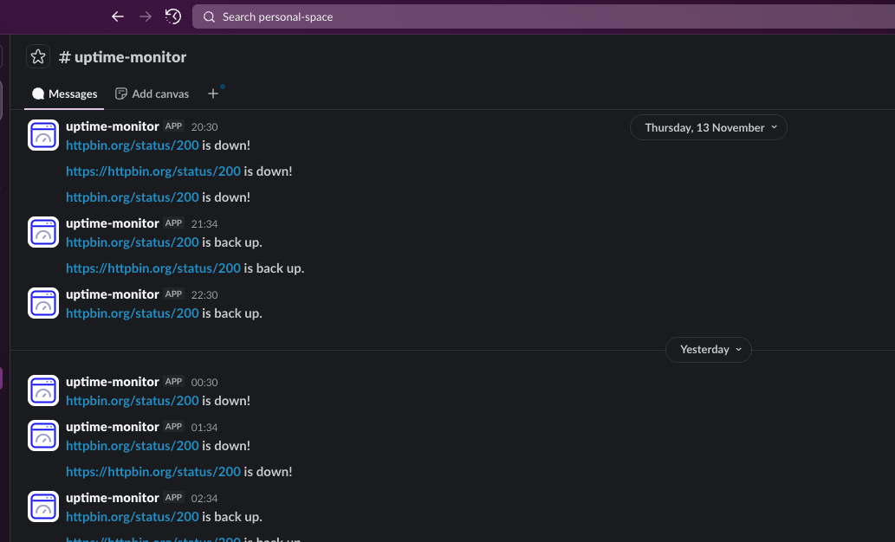

<h1>
  
  Uptime Monitor
</h1>

An uptime monitoring service that continuously monitors the uptime of a list of websites. When it detects a website is down, it posts a Slack message notifying that the website is down, and another message when the website is back up again.

## Table of Contents

- [Architecture](#architecture)
- [Usage](#usage)
  - [Site Service](#site-service)
  - [Monitor Service](#monitor-service)
  - [Slack notifications](#slack-notifications-private-integration)
- [Contributing](#contributing)

## Architecture


The architecture consists of:
- **Site service**: Stores the list of sites to monitor.
- **Monitor service**: Pings sites, records checks, returns status, and runs a scheduled job to check all sites hourly.
- **Slack integration**: Subscribes to state transitions (up → down and down → up) and sends messages via a Slack Incoming Webhook.

## Usage

All public endpoints are accessible under the base URL:

`https://staging-uptime-monitor-vbvi.encr.app`

Below are practical examples using curl. Replace IDs and URLs as needed.

### Site Service 


#### Add a site

```bash
curl -s -X POST \
  -H "Content-Type: application/json" \
  -d '{"url":"https://example.com"}' \
  https://staging-uptime-monitor-vbvi.encr.app/site
```

Response:

```json
{
  "id": 1,
  "url": "https://example.com"
}
```

#### List all sites

```bash
curl -s https://staging-uptime-monitor-vbvi.encr.app/site
```

Response:

```json
{
  "sites": [
    { "id": 1, "url": "https://example.com" },
    { "id": 2, "url": "https://api.example.com/health" }
  ]
}
```

#### Get a site by ID

```bash
curl -s https://staging-uptime-monitor-vbvi.encr.app/site/1
```

Response:

```json
{ "id": 1, "url": "https://example.com" }
```

#### Delete a site by ID

```bash
curl -s -X DELETE https://staging-uptime-monitor-vbvi.encr.app/site/1
```

Status 200 indicates success (empty body).

### Monitor Service 


#### Ping a URL on-demand

You can pass a bare hostname (scheme is optional; defaults to https).

```bash
curl -s https://staging-uptime-monitor-vbvi.encr.app/ping/example.com
```

Response:

```json
{ "up": true }
```

#### Check a single monitored site by ID

```bash
curl -s -X POST https://staging-uptime-monitor-vbvi.encr.app/check/1
```

Status 200 indicates success (empty body).

#### Check all monitored sites concurrently

```bash
curl -s -X POST https://staging-uptime-monitor-vbvi.encr.app/checkall
```

Status 200 indicates success (empty body).

#### Get current status for all sites

```bash
curl -s https://staging-uptime-monitor-vbvi.encr.app/status
```

Response:

```json
{
  "sites": {
    "1": { "up": true,  "checked_at": "2025-11-14T10:15:30Z" },
    "2": { "up": false, "checked_at": "2025-11-14T10:16:05Z" }
  }

```

### Slack notifications (private integration)



The Slack endpoint is private and not exposed publicly. To enable notifications in your own deployment, configure the `SlackWebhookURL` secret so that the subscription can post messages when a site transitions between up and down states.

## Contributing

- **Fork and branch**: Fork the repo and create a feature branch.
- **PRs**: Open a pull request with a summary of the change, screenshots or logs if relevant, and any considerations for deployment.

Thank you for contributing!

